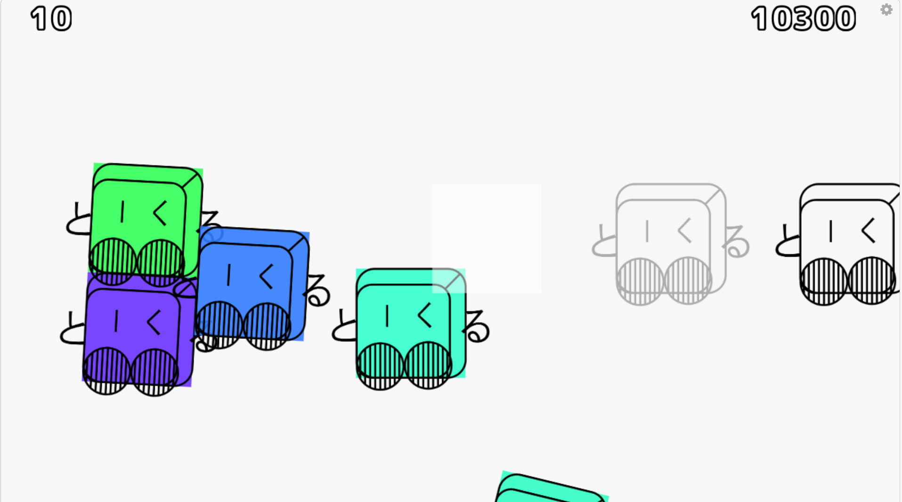

# Kuruton Rhythm Game

Akashic Engine を使用して制作したリズムゲーム風ミニゲームです。  
タイミングに合わせてクリックし、スコアを獲得します。

## 🎮 Overview

ランダムな位置に出現するターゲットに対して、タイミングよく入力を行うことでスコアを獲得するシンプルなリズムアクションです。

- ノーツは時間に応じて生成
- 判定タイミングに応じてスコアが変化
- 制限時間終了後にリザルト画面へ遷移

## ✨ Features

- Akashic Engine を用いたブラウザゲーム
- ノーツ生成をデータ（配列）で管理
- タイミング判定（Perfect / Great / Good）
- スコア・タイマー・リザルト画面の実装
- Box2D を用いた簡単な演出

## 🛠 Tech Stack

- JavaScript
- Akashic Engine
- akashic-box2d

## 🧠 Implementation Highlights

- ノーツを配列で管理し、時間に応じて生成
- アクティブなノーツをリストで管理し、入力時に一括判定
- 判定処理を関数化し、ロジックを分離
- 不要コードの削除と定数化により可読性を改善

## 📸 Screenshots

### Gameplay


## 🚧 Notes

本プロジェクトはポートフォリオ用に整理したものです。  
一部の処理や構成は、学習・改善を目的としてリファクタリングを行っています。

## 📦 How to Run

Akashic Engine の環境で実行可能です。

```bash
akashic serve